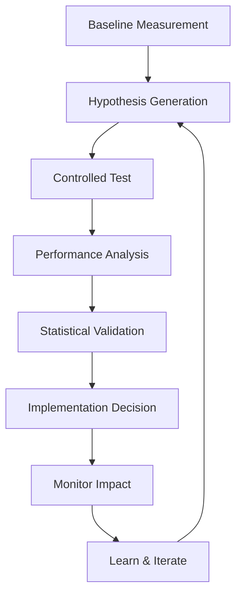

# Prompt Optimization Frameworks

This reference provides systematic methodologies for iteratively improving prompt performance through structured testing, measurement, and refinement processes.

## Optimization Process Overview

### Iterative Improvement Cycle


### Core Optimization Principles
- **Single Variable Testing**: Change one element at a time for accurate attribution
- **Measurable Metrics**: Define quantitative success criteria
- **Statistical Significance**: Use proper sample sizes and validation methods
- **Controlled Environment**: Test conditions must be consistent
- **Baseline Comparison**: Always measure against established baseline

## Performance Metrics Framework

### Primary Metrics

#### Task Success Rate
```python
def calculate_success_rate(results, expected_outputs):
    """
    Measure percentage of tasks completed correctly.
    """
    correct = sum(1 for result, expected in zip(results, expected_outputs)
                  if result == expected)
    return (correct / len(results)) * 100
```

#### Response Consistency
```python
def measure_consistency(prompt, test_cases, num_runs=5):
    """
    Measure response stability across multiple runs.
    """
    responses = {}
    for test_case in test_cases:
        test_responses = []
        for _ in range(num_runs):
            response = execute_prompt(prompt, test_case)
            test_responses.append(response)

        # Calculate similarity score for consistency
        consistency = calculate_similarity(test_responses)
        responses[test_case] = consistency

    return sum(responses.values()) / len(responses)
```

#### Token Efficiency
```python
def calculate_token_efficiency(prompt, test_cases):
    """
    Measure token usage per successful task completion.
    """
    total_tokens = 0
    successful_tasks = 0

    for test_case in test_cases:
        response = execute_prompt_with_metrics(prompt, test_case)
        total_tokens += response.token_count
        if response.is_successful:
            successful_tasks += 1

    return total_tokens / successful_tasks if successful_tasks > 0 else float('inf')
```

#### Response Latency
```python
def measure_response_time(prompt, test_cases):
    """
    Measure average response time.
    """
    times = []
    for test_case in test_cases:
        start_time = time.time()
        execute_prompt(prompt, test_case)
        end_time = time.time()
        times.append(end_time - start_time)

    return sum(times) / len(times)
```

### Secondary Metrics

#### Output Quality Score
```python
def assess_output_quality(response, criteria):
    """
    Multi-dimensional quality assessment.
    """
    scores = {
        'accuracy': measure_accuracy(response),
        'completeness': measure_completeness(response),
        'coherence': measure_coherence(response),
        'relevance': measure_relevance(response),
        'format_compliance': measure_format_compliance(response)
    }

    weights = [0.3, 0.2, 0.2, 0.2, 0.1]
    return sum(score * weight for score, weight in zip(scores.values(), weights))
```

#### Safety Compliance
```python
def check_safety_compliance(response):
    """
    Measure adherence to safety guidelines.
    """
    violations = []

    # Check for various safety issues
    if contains_harmful_content(response):
        violations.append('harmful_content')
    if has_bias(response):
        violations.append('bias')
    if violates_privacy(response):
        violations.append('privacy_violation')

    safety_score = max(0, 100 - len(violations) * 25)
    return safety_score, violations
```

## A/B Testing Methodology

### Controlled Test Design
```python
def design_ab_test(baseline_prompt, variant_prompt, test_cases):
    """
    Design controlled A/B test with proper statistical power.
    """
    # Calculate required sample size
    effect_size = estimate_effect_size(baseline_prompt, variant_prompt)
    sample_size = calculate_sample_size(effect_size, power=0.8, alpha=0.05)

    # Random assignment
    randomized_cases = random.sample(test_cases, sample_size)
    split_point = len(randomized_cases) // 2

    group_a = randomized_cases[:split_point]
    group_b = randomized_cases[split_point:]

    return {
        'baseline_group': group_a,
        'variant_group': group_b,
        'sample_size': sample_size,
        'statistical_power': 0.8,
        'significance_level': 0.05
    }
```

### Statistical Analysis
```python
def analyze_ab_results(baseline_results, variant_results):
    """
    Perform statistical analysis of A/B test results.
    """
    # Calculate means and standard deviations
    baseline_mean = np.mean(baseline_results)
    variant_mean = np.mean(variant_results)
    baseline_std = np.std(baseline_results)
    variant_std = np.std(variant_results)

    # Perform t-test
    t_statistic, p_value = stats.ttest_ind(baseline_results, variant_results)

    # Calculate effect size (Cohen's d)
    pooled_std = np.sqrt(((len(baseline_results) - 1) * baseline_std**2 +
                         (len(variant_results) - 1) * variant_std**2) /
                        (len(baseline_results) + len(variant_results) - 2))
    cohens_d = (variant_mean - baseline_mean) / pooled_std

    return {
        'baseline_mean': baseline_mean,
        'variant_mean': variant_mean,
        'improvement': ((variant_mean - baseline_mean) / baseline_mean) * 100,
        'p_value': p_value,
        'statistical_significance': p_value < 0.05,
        'effect_size': cohens_d,
        'recommendation': 'implement_variant' if p_value < 0.05 and cohens_d > 0.2 else 'keep_baseline'
    }
```

## Optimization Strategies

### Strategy 1: Progressive Enhancement

#### Stepwise Improvement Process
```python
def progressive_optimization(base_prompt, test_cases, max_iterations=10):
    """
    Incrementally improve prompt through systematic testing.
    """
    current_prompt = base_prompt
    current_performance = evaluate_prompt(current_prompt, test_cases)
    optimization_history = []

    for iteration in range(max_iterations):
        # Generate improvement hypotheses
        hypotheses = generate_improvement_hypotheses(current_prompt, current_performance)

        best_improvement = None
        best_performance = current_performance

        for hypothesis in hypotheses:
            # Test hypothesis
            test_prompt = apply_hypothesis(current_prompt, hypothesis)
            test_performance = evaluate_prompt(test_prompt, test_cases)

            # Validate improvement
            if is_statistically_significant(current_performance, test_performance):
                if test_performance.overall_score > best_performance.overall_score:
                    best_improvement = hypothesis
                    best_performance = test_performance

        # Apply best improvement if found
        if best_improvement:
            current_prompt = apply_hypothesis(current_prompt, best_improvement)
            optimization_history.append({
                'iteration': iteration,
                'hypothesis': best_improvement,
                'performance_before': current_performance,
                'performance_after': best_performance,
                'improvement': best_performance.overall_score - current_performance.overall_score
            })
            current_performance = best_performance
        else:
            break  # No further improvements found

    return current_prompt, optimization_history
```

### Strategy 2: Multi-Objective Optimization

#### Pareto Optimization Framework
```python
def multi_objective_optimization(prompt_variants, objectives):
    """
    Optimize for multiple competing objectives using Pareto efficiency.
    """
    results = []

    for variant in prompt_variants:
        scores = {}
        for objective in objectives:
            scores[objective] = evaluate_objective(variant, objective)

        results.append({
            'prompt': variant,
            'scores': scores,
            'dominates': []
        })

    # Find Pareto optimal solutions
    pareto_optimal = []
    for i, result_i in enumerate(results):
        is_dominated = False
        for j, result_j in enumerate(results):
            if i != j and dominates(result_j, result_i):
                is_dominated = True
                break

        if not is_dominated:
            pareto_optimal.append(result_i)

    return pareto_optimal

def dominates(result_a, result_b):
    """
    Check if result_a dominates result_b in all objectives.
    """
    return all(result_a['scores'][obj] >= result_b['scores'][obj]
               for obj in result_a['scores'])
```

### Strategy 3: Adaptive Testing

#### Dynamic Test Allocation
```python
def adaptive_testing(prompt_variants, initial_budget):
    """
    Dynamically allocate testing budget to promising variants.
    """
    # Initial exploration phase
    exploration_results = {}
    budget分配 = initial_budget // len(prompt_variants)

    for variant in prompt_variants:
        exploration_results[variant] = test_prompt(variant, budget分配)

    # Exploitation phase - allocate more budget to promising variants
    total_budget_spent = len(prompt_variants) * budget分配
    remaining_budget = initial_budget - total_budget_spent

    # Sort by performance
    sorted_variants = sorted(exploration_results.items(),
                           key=lambda x: x[1].overall_score, reverse=True)

    # Allocate remaining budget proportionally to performance
    final_results = {}
    for i, (variant, initial_result) in enumerate(sorted_variants):
        if remaining_budget > 0:
            additional_budget = max(1, remaining_budget // (len(sorted_variants) - i))
            final_results[variant] = test_prompt(variant, additional_budget)
            remaining_budget -= additional_budget
        else:
            final_results[variant] = initial_result

    return final_results
```

## Optimization Hypotheses

### Common Optimization Areas

#### Instruction Clarity
```python
instruction_clarity_hypotheses = [
    "Add numbered steps to instructions",
    "Include specific output format examples",
    "Clarify role and expertise level",
    "Add context and background information",
    "Specify constraints and boundaries",
    "Include success criteria and evaluation standards"
]
```

#### Example Quality
```python
example_optimization_hypotheses = [
    "Increase number of examples from 3 to 5",
    "Add edge case examples",
    "Reorder examples by complexity",
    "Include negative examples",
    "Add reasoning traces to examples",
    "Improve example diversity and coverage"
]
```

#### Structure Optimization
```python
structure_hypotheses = [
    "Add clear section headings",
    "Reorganize content flow",
    "Include summary at the beginning",
    "Add checklist for verification",
    "Separate instructions from examples",
    "Add troubleshooting section"
]
```

#### Model-Specific Optimization
```python
model_specific_hypotheses = {
    'claude': [
        "Use XML tags for structure",
        "Add <thinking> sections for reasoning",
        "Include constitutional AI principles",
        "Use system message format",
        "Add safety guidelines and constraints"
    ],
    'gpt-4': [
        "Use numbered sections with ### headers",
        "Include JSON format specifications",
        "Add function calling patterns",
        "Use bullet points for clarity",
        "Include error handling instructions"
    ],
    'gemini': [
        "Use bold headers with ** formatting",
        "Include step-by-step process descriptions",
        "Add validation checkpoints",
        "Use conversational tone",
        "Include confidence scoring"
    ]
}
```

## Continuous Monitoring

### Production Performance Tracking
```python
def setup_monitoring(prompt, alert_thresholds):
    """
    Set up continuous monitoring for deployed prompts.
    """
    monitors = {
        'success_rate': MetricMonitor('success_rate', alert_thresholds['success_rate']),
        'response_time': MetricMonitor('response_time', alert_thresholds['response_time']),
        'token_cost': MetricMonitor('token_cost', alert_thresholds['token_cost']),
        'safety_score': MetricMonitor('safety_score', alert_thresholds['safety_score'])
    }

    def monitor_performance():
        recent_data = collect_recent_performance(prompt)
        alerts = []

        for metric_name, monitor in monitors.items():
            if metric_name in recent_data:
                alert = monitor.check(recent_data[metric_name])
                if alert:
                    alerts.append(alert)

        return alerts

    return monitor_performance
```

### Automated Rollback System
```python
def automated_rollback_system(prompts, monitoring_data):
    """
    Automatically rollback to previous version if performance degrades.
    """
    def check_and_rollback(current_prompt, baseline_prompt):
        current_metrics = monitoring_data.get_metrics(current_prompt)
        baseline_metrics = monitoring_data.get_metrics(baseline_prompt)

        # Check if performance degradation exceeds threshold
        degradation_threshold = 0.1  # 10% degradation

        for metric in current_metrics:
            if current_metrics[metric] < baseline_metrics[metric] * (1 - degradation_threshold):
                return True, f"Performance degradation in {metric}"

        return False, "Performance acceptable"

    return check_and_rollback
```

## Optimization Tools and Utilities

### Prompt Variation Generator
```python
def generate_prompt_variations(base_prompt):
    """
    Generate systematic variations for testing.
    """
    variations = {}

    # Instruction variations
    variations['more_detailed'] = add_detailed_instructions(base_prompt)
    variations['simplified'] = simplify_instructions(base_prompt)
    variations['structured'] = add_structured_format(base_prompt)

    # Example variations
    variations['more_examples'] = add_examples(base_prompt)
    variations['better_examples'] = improve_example_quality(base_prompt)
    variations['diverse_examples'] = add_example_diversity(base_prompt)

    # Format variations
    variations['numbered_steps'] = add_numbered_steps(base_prompt)
    variations['bullet_points'] = use_bullet_points(base_prompt)
    variations['sections'] = add_section_headers(base_prompt)

    return variations
```

### Performance Dashboard
```python
def create_performance_dashboard(optimization_history):
    """
    Create visualization of optimization progress.
    """
    # Generate performance metrics over time
    metrics_over_time = {
        'iterations': [h['iteration'] for h in optimization_history],
        'success_rates': [h['performance_after'].success_rate for h in optimization_history],
        'token_efficiency': [h['performance_after'].token_efficiency for h in optimization_history],
        'response_times': [h['performance_after'].response_time for h in optimization_history]
    }

    return PerformanceDashboard(metrics_over_time)
```

This comprehensive framework provides systematic methodologies for continuous prompt improvement through data-driven optimization and rigorous testing processes.